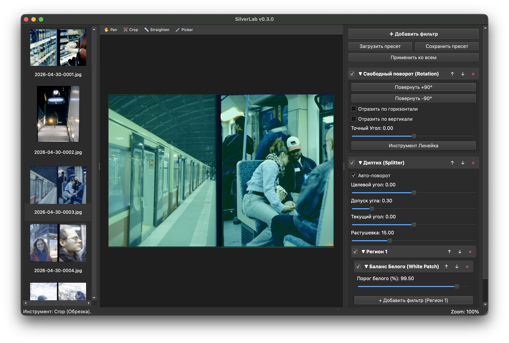

# SilverLab

Инструмент для обработки пленочных сканов и сборки диптихов.

Домашнее сканирование пленки часто выдает "сырые" файлы, требующие серьезной геометрической и цветовой доработки. При этом универсальные редакторы уровня Photoshop или Lightroom плохо подходят для пленочной специфики. Выравнивание границ кадра, работа с подложкой и точное сведение цвета требуют от пользователя огромного количества ручных действий. 

**SilverLab** — *это кроссплатформенный десктопный редактор, созданный CV-инженером и пленочным фотографом для такого же комьюнити энтузиастов.* Используя методы компьютерного зрения, программа автоматически решает проблемы геометрии и цвета, позволяя вам сфокусироваться на эстетике изображения.



### ✨ Основные возможности

- Универсальность форматов: Программа одинаково хорошо понимает как классические одиночные сканы (35-мм, средний формат), так и составные диптихи с полукадровых камер. Границы кадра можно свободно двигать, а половинки диптихов — менять местами обычным перетаскиванием.

- Модульная обработка (Нодовый конвейер): Вы сами решаете, как строится процесс цветокоррекции. Алгоритм обработки собирается из отдельных блоков (управление точкой черного, баланс белого, контраст). Вы можете настраивать каждый шаг и менять блоки местами для получения нужного цвета.

- Недеструктивный подход: Никакого прямого вмешательства в пиксели до самого конца. Программа работает с полным динамическим диапазоном сканера. Ваши оригинальные 16-битные TIFF-файлы остаются нетронутыми, а все изменения применяются «на лету» только в оперативной памяти.

- Пакетная синхронизация: Настроили идеальный цвет и поправили горизонт на одном кадре? Скопируйте эти параметры на всю катушку в один клик и отправьте файлы на экспорт в фоновом режиме.

### 🚀 Установка и запуск

#### Вариант 1: Готовые сборки (Рекомендуется)

Скомпилированные версии, готовые к работе, лежат в разделе [Releases](https://github.com/gosha20777/SilverLab/releases):

- 🪟 Windows: Скачайте и запустите .exe инсталлятор.

- 🍎 macOS: Скачайте образ .dmg и перетащите приложение в папку Applications.

- 🐧 Linux: Доступна сборка в формате Flatpak.

#### Вариант 2: Запуск из исходников
Для разработчиков:

```Bash
# 1. Клонируем репозиторий
git clone git@github.com:gosha20777/SilverLab.git
cd SilverLab

# 2. Создаем изолированное окружение
mamba create -n SilverLab python=3.14
conda activate SilverLab

# 3. Устанавливаем зависимости
pip install -r requirements.txt

# 4. Запускаем приложение
python main.py
```

## 🗺️ Планы на будущее (Roadmap)
Проект активно разрабатывается. Вот что появится в следующих обновлениях:


- ⚡ GPU-ускорение: Использование видеокарты для плавной работы с очень тяжелыми сканами в реальном времени.

- 🌍 Локализация: Полноценный перевод интерфейса и отказ от смеси русского и английского языков.

- 🎛 Отзывчивость UI: Оптимизация работы холста, более плавный скроллинг и зум.

- 🤖 AI-инструментарий: Добавление умных алгоритмов, которые сохранят парадигму недеструктивности:
    - Редактирование цветопередачи кадра с помощью текстовых промптов [1](https://arxiv.org/abs/2401.16468).
    - Автоматический баланс белого [2](https://arxiv.org/pdf/2504.05623).
    - Перенос цвета и стиля (Style Transfer) с референсов на базе алгоритмов оптимального транспорта (Optimal Transport) [3](https://arxiv.org/abs/2503.19062).
    - Естественная колоризация черно-белых фотографий [4](https://arxiv.org/abs/1705.02999).
    - Автоматическое кадрирование [5](https://arxiv.org/abs/2510.22528).

## 🤝 Участие в разработке и Лицензия
Проект открыт и распространяется под лицензией **GNU GPL v3.0**.

Если вы хотите помочь с кодом, я всегда буду рад `Pull Requests`.